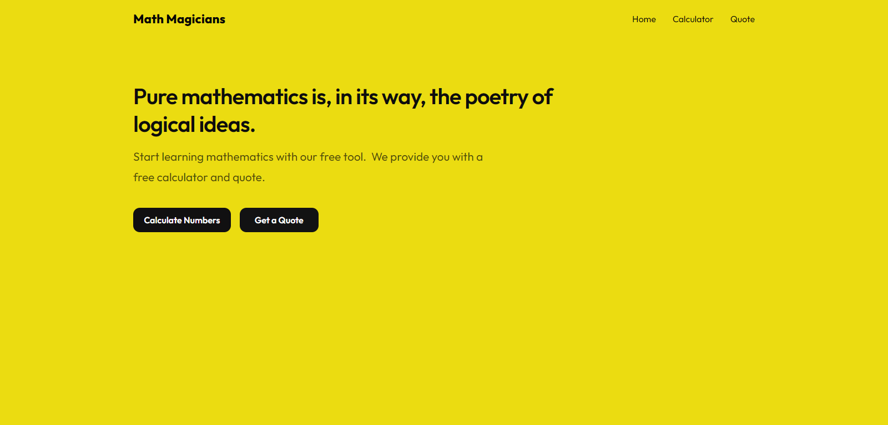

# Math-Magicians
Math magicians is a website for all fans of mathematics. It is a Single Page App (SPA) that allows users to make simple calculations and read a random math-related quote.

This project is part of the Microverse curriculum Module 3 Block 1. The main objective is about building your web application using React.

## Desktop 💻

## Built With

- Html/Css
- JavaScript
- React

## Additional Tools

- Webhint
- Stylelint
- Eslint
- Lighthouse
- Webpack

## Installation

Go to your terminal, navigate to your working directory and run

`git clone https://github.com/kingqabil/math-magicians.git`

After that navigate to the newly created folder

`cd math-magicians`

You now have access to the files.
To install necessary dependencies run

`npm install`

Start a local server running the command

`npm start`

You should now have the project running locally on a dev server.

## Authors

👤 **SadiQ HabiL**

- GitHub: [@kingqabil](https://github.com/kingqabil)
- Twitter: [@kingqabil](https://twitter.com/kingqabil)
- LinkedIn: [@kingqabil](https://linkedin.com/in/kingqabil)

## 🤝 Contributing

Contributions, issues, and feature requests are welcome!

Feel free to check the [issues page](../../issues/).

## Show your support

Give a ⭐️ if you like this project!

## Acknowledgments

- Hat tip to anyone whose code was used
- Inspiration
- etc

## 📝 License

This project is [MIT](./MIT.md) licensed.
